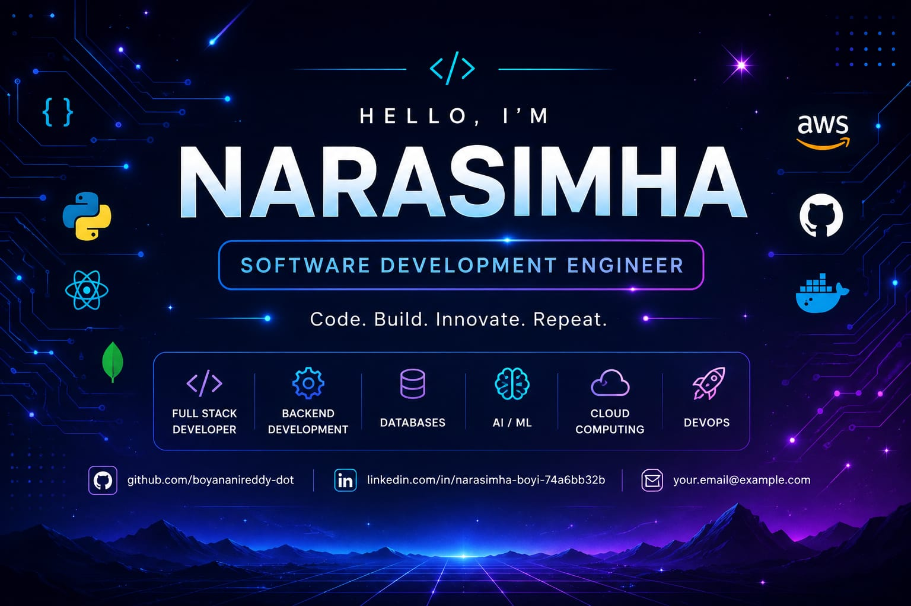

  

<!-- ========================================================= -->
<!--                         ABOUT ME                          -->
<!-- ========================================================= -->

# 👋 about me

i'm an aspiring <b>software development engineer</b> passionate about
building real-world software, solving problems with code and continuously
improving my technical skills.

<table align="center">
<tr>

<td width="50%" valign="top">

### 🌱 currently learning

- 🐍 python
- 🧠 data structures & algorithms
- ⚙️ backend development
- 🌐 web development
- 🤖 ai / machine learning
- 🗄️ databases
- ☁️ cloud technologies
- 🚀 devops

</td>

<td width="50%" valign="top">

### 🎯 current goals

- 💻 become a strong software developer
- 🧠 improve problem-solving skills
- 🏗️ build real-world projects
- 🔌 develop backend systems
- 🤖 explore ai/ml applications
- ☁️ learn cloud deployment
- 🚀 become industry-ready

</td>

</tr>
</table>

 

<!-- ========================================================= -->
<!--                       TECH ARSENAL                        -->
<!-- ========================================================= -->

# 🛠️ my tech arsenal

 

## 💻 programming languages

<table>
<tr>

<td align="center">

 
<b>python</b>
</td>

<td align="center">

 
<b>javascript</b>
</td>

</tr>
</table>

 

## 🎨 frontend development

<table>
<tr>

<td align="center">

 
<b>html5</b>
</td>

<td align="center">

 
<b>css3</b>
</td>

<td align="center">

 
<b>javascript</b>
</td>

<td align="center">

 
<b>react</b>
</td>

<td align="center">

 
<b>typescript</b>
</td>

</tr>
</table>

 

## ⚙️ backend development

<table>
<tr>

<td align="center">

 
<b>python</b>
</td>

<td align="center">

 
<b>flask</b>
</td>

<td align="center">

 
<b>fastapi</b>
</td>

<td align="center">

 
<b>node.js</b>
</td>

<td align="center">

 
<b>rest api</b>
</td>

</tr>
</table>

 

## 🗄️ databases

<table>
<tr>

<td align="center">

 
<b>mysql</b>
</td>

<td align="center">

 
<b>postgresql</b>
</td>

<td align="center">

 
<b>mongodb</b>
</td>

<td align="center">

 
<b>redis</b>
</td>

</tr>
</table>

 

## 🤖 ai / ml

<table>
<tr>

<td align="center">

 
<b>python</b>
</td>

<td align="center">

 
<b>pytorch</b>
</td>

<td align="center">

 
<b>tensorflow</b>
</td>

<td align="center">

 
<b>opencv</b>
</td>

</tr>
</table>

 

`numpy` &nbsp;•&nbsp;
`pandas` &nbsp;•&nbsp;
`scikit-learn` &nbsp;•&nbsp;
`machine learning` &nbsp;•&nbsp;
`computer vision` &nbsp;•&nbsp;
`llm apis` &nbsp;•&nbsp;
`rag`

 

## 🚀 devops

<table>
<tr>

<td align="center">

 
<b>git</b>
</td>

<td align="center">

 
<b>github</b>
</td>

<td align="center">

 
<b>linux</b>
</td>

<td align="center">

 
<b>docker</b>
</td>

<td align="center">

 
<b>github actions</b>
</td>

</tr>
</table>

 

## ☁️ cloud

<table>
<tr>

<td align="center">

 
<b>aws</b>
</td>

</tr>
</table>

 

<!-- ========================================================= -->
<!--                       TECH STACK                          -->
<!-- ========================================================= -->

# 🔥 sde technology stack

<table>
<tr>

<td align="center">

### 🎨 frontend

html  
css  
javascript  
react  
typescript

</td>

<td align="center">

### ⚙️ backend

python  
flask  
fastapi  
rest api  
node.js

</td>

<td align="center">

### 🗄️ database

sql  
postgresql  
mongodb  
redis

</td>

</tr>

<tr>

<td align="center">

### 🤖 ai / ml

numpy  
pandas  
scikit-learn  
pytorch  
llm apis  
rag

</td>

<td align="center">

### 🚀 devops

git  
github  
linux  
docker  
github actions

</td>

<td align="center">

### ☁️ cloud

aws  
cloud deployment  
server management

</td>

</tr>
</table>

 

<!-- ========================================================= -->
<!--                      CURRENT FOCUS                        -->
<!-- ========================================================= -->

# 🎯 current focus

<table align="center">
<tr>

<td align="center" width="200">

### 🧠 dsa

data structures  
algorithms  
problem solving

</td>

<td align="center" width="200">

### ⚙️ backend

python  
flask  
fastapi  
rest apis

</td>

<td align="center" width="200">

### 🤖 ai / ml

machine learning  
computer vision  
ai applications

</td>

<td align="center" width="200">

### ☁️ cloud

aws  
docker  
deployment

</td>

</tr>
</table>

 

<!-- ========================================================= -->
<!--                         PROJECTS                           -->
<!-- ========================================================= -->

# 🚀 featured projects

 

### 🎓 role-based personalised learning pathway engine

A software project focused on creating personalised learning pathways based on user roles, skills and learning requirements.

**technology focus:** python • backend • ai/ml • personalisation

---

### 🌉 skill-bridgex

A software project focused on connecting skills, learning and career development.

**technology focus:** software development • backend • learning systems

---

### 💰 expense tracker

A web-based application for managing and tracking personal expenses.

**technology focus:** frontend • backend • database

---

### 🔐 life vault

A project focused on organising and managing important personal information.

**technology focus:** backend • database • security

---

### 🎓 student os

A student-focused software application designed to organise academic activities and resources.

**technology focus:** software development • database • web technologies

 

<!-- ========================================================= -->
<!--                    GITHUB STATISTICS                      -->
<!-- ========================================================= -->

# 📊 github statistics

 

 

<!-- ========================================================= -->
<!--                     GITHUB STREAK                         -->
<!-- ========================================================= -->

# 🔥 github streak

 

 

<!-- ========================================================= -->
<!--                  CONTRIBUTION ACTIVITY                    -->
<!-- ========================================================= -->

# 📈 contribution activity

 

 

<!-- ========================================================= -->
<!--                         FOOTER                            -->
<!-- ========================================================= -->

━━━━━━━━━━━━━━━━━━━━━━━━━━━━━━━━━━━━━━━━━━━━━━━━━━━━

 

### ✨ `code` • `build` • `learn` • `innovate`

 

**keep learning • keep building • keep growing**

  

`made with ❤️ by narasimha`

